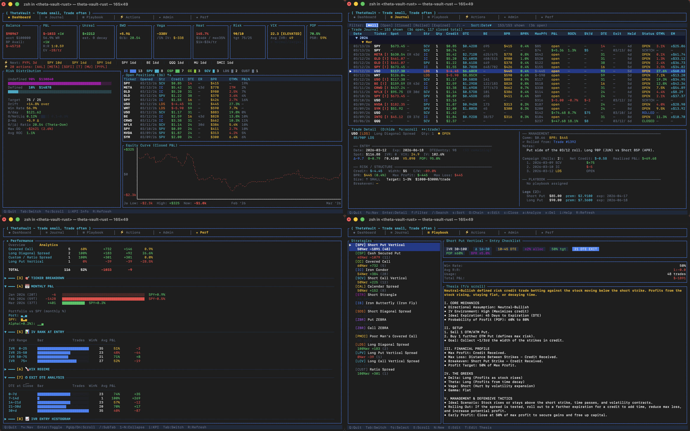

# ThetaVault 2.0 (Rust Edition)



A high-performance, terminal-based options trading journal inspired by the tastytrade mechanics.

## 🚀 Why Rust?
- **Zero Latency:** Instant startup and UI updates.
- **Portability:** Compiles to a single binary. No Node.js or Docker required.
- **Reliability:** Strict typing ensures your trade math is always correct.

## 🛠 Tech Stack
- **UI:** `ratatui` (TUI library)
- **Database:** `SQLite` (Single-file portable database)
- **Runtime:** `Tokio` (Async processing)

## 🏁 Getting Started

1. **Install Rust:**
   ```bash
   curl --proto '=https' --tlsv1.2 -sSf https://sh.rustup.rs | sh
   ```

2. **Run the App:**
   ```bash
   cargo run
   ```

3. **Build Release Binary:**
   ```bash
   cargo build --release
   # Binary located at target/release/theta-vault-rust
   ```

## ⌨️ Controls

### Global
| Key | Action |
|-----|--------|
| `Tab` / `Shift+Tab` | Switch tabs |
| `Q` | Quit |
| `R` | Refresh data |

### Dashboard (Tab 1)
| Key | Action |
|-----|--------|
| `↑↓` | Scroll |
| `i` | KPI info popup |

### Journal (Tab 2)
| Key | Action |
|-----|--------|
| `↑↓` / `j` / `k` | Navigate trades |
| `Enter` | Toggle trade detail pane |
| `←→` | Prev/next trade (in detail pane) |
| `e` | Edit trade |
| `c` | Close trade |
| `a` | Analyze trade (payoff chart) |
| `x` / `Del` | Delete trade |
| `f` | Cycle filter (All / Open / Closed / Rolled / Expired) |
| `F` | Clear filter |
| `/` | Search by ticker |
| `s` | Sort by next column |
| `S` | Reverse sort |
| `G` | Toggle chain view (groups rolls together) |
| `v` | Column visibility picker |
| `i` | Help popup |
| `PgUp` / `PgDn` | Scroll 10 rows |
| `Home` / `End` | Jump to first/last trade |

### Playbook (Tab 3)
| Key | Action |
|-----|--------|
| `↑↓` / `j` / `k` | Select strategy |
| `←→` / `h` / `l` | Scroll thesis |
| `N` | New playbook |
| `E` / `Enter` | Edit playbook |
| `T` | Edit thesis |

### Actions (Tab 4)
| Key | Action |
|-----|--------|
| `↑↓` | Navigate |
| `Enter` | Expand / follow to journal |

### Admin (Tab 5)
| Key | Action |
|-----|--------|
| `e` | Edit settings |
| `E` | Export all trades to CSV |
| `Ctrl+S` | Save settings (in edit mode) |
| `Esc` | Cancel edit |

### Performance (Tab 6)
| Key | Action |
|-----|--------|
| `↑↓` | Navigate sections |
| `Enter` | Collapse/expand section |
| `1`–`0` | Toggle individual section |
| `/` | Switch sub-tab (Overview / Analytics) |
| `PgUp` / `PgDn` | Scroll |
| `i` | KPI definitions popup |

### Edit / Form Mode (any tab)
| Key | Action |
|-----|--------|
| `Tab` / `↓` | Next field |
| `Shift+Tab` / `↑` | Previous field |
| `Ctrl+S` | Save |
| `Esc` | Cancel |
| `Ctrl+A` | Add leg |
| `Ctrl+D` | Delete leg |
| `+` / `-` | Cycle enum values |
